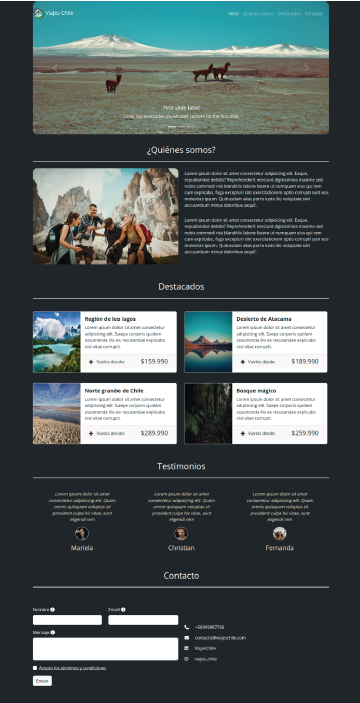

# Descripcion del proyecto 

Actualizacion del landing pages viajes chile, esta vez incluye nuevas secciones y tecnologias como es el trabajar con el framework de bootstrap y sass. la direccion a la GitHub pages es: 

la maqueta utilizada para el desafio es la siguiente:

# Instalacion de bootstrap

Para la instalacion de bootstrap se trabajo desde la `cmd`, creando desde la carpteta hasta la instalación de bootstrap. Para ello se utilizaron los siguientes comandos.

**mkdir "viajes chile"**
**cd viajes chile**
**npm init -y**
**npm install bootstrap**

